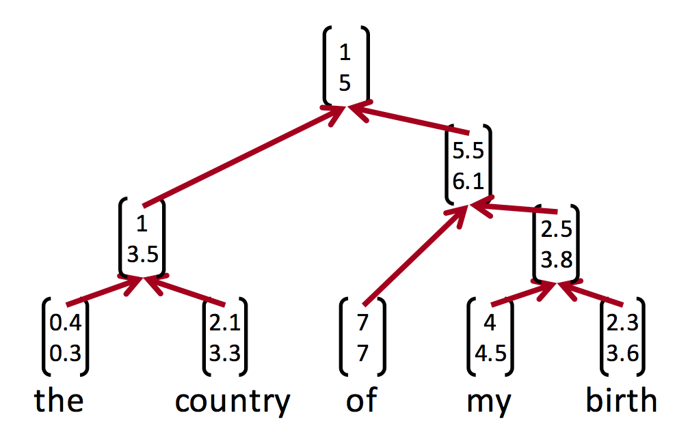

## Efficient recursive (tree-structured) neural networks in TensorFlow

Note: this tutorial assumes you are already familiar with [recursive neural networks](http://cs224d.stanford.edu/lectures/CS224d-Lecture10.pdf) and the basics of [TensorFlow programming](https://www.tensorflow.org/versions/r0.10/tutorials/index.html), otherwise it may be helpful to read up on both first.
The tutorial and code follow the tree-net assignment of the (fantastic) Stanford CS224D class, and would be most useful to those who have attempted it on their own.


Recursive neural networks (also known as tree-structured, not to be confused with recurrent) provide state-of-the-art results on sentiment analysis tasks, but, due to network architecture being different for every example, can be hard to implement efficiently. Here we will benchmark two possible implementations.
Complete implementations are in [rnn\_dynamic\_graph.py](rnn_dynamic_graph.py) and [rnn\_static\_graph.py](rnn_static_graph.py) files.


### Option 1: build the graph dynamically per example

Represent the tree as a graph:

```python
class Node:  # a node in the tree
  def __init__(self, ...):
    self.isLeaf = True / False
    self.hidden_state = None
    # for leaves
    self.word = word
    # for inner nodes
    self.left = None  # reference to left child
    self.right = None  # reference to right child
    ...
```

Define weights (once per execution):
```python
class RNN_Model():
  def add_model_vars(self):
    with tf.variable_scope('Embeddings'):
      embeddings = \
        tf.get_variable('embeddings', [len(self.vocab), self.config.embed_size])
    with tf.variable_scope('Composition'):
      W1 = tf.get_variable('W1',
                      [2 * self.config.embed_size, self.config.embed_size])
      b1 = tf.get_variable('b1', [1, self.config.embed_size])
    with tf.variable_scope('Projection'):
      U = tf.get_variable('U', [self.config.embed_size, self.config.label_size])
      bs = tf.get_variable('bs', [1, self.config.label_size])
```

Build computational graph recursively using tree traversal (once per every input example):
```python
  def build_subtree_model(node):
    if node.isLeaf:
      # lookup word embeddings
      node.hidden_state = tf.nn.embedding_lookup(embeddings,
                                                 vocab.encode(node.word))
    else:
      # build the model recursively and combine children nodes
      left_tensor = build_subtree_model(node.left)
      right_tensor = build_subtree_model(node.right)
      node.hidden_state = tf.nn.relu(tf.matmul(tf.concat(1, [left_tensor, right_tensor]), W1) + b1)
    return node.hidden_state
```

Since we add dozens of nodes to the graph for every example, we have to reset the default graph every once in a while to save RAM:
```python
  def training_or_inference(self, input_trees):
    for i in xrange(INPUT_BATCHES):
      with tf.Graph().as_default(), tf.Session() as sess:
        self.add_model_vars()
        saver = tf.train.Saver()
        saver.restore(sess, backup_path)
        for tree in trees[i * BATCH_SIZE:(i + 1) * BATCH_SIZE]:
          ### run training or inference ###
        saver.save(sess, backup_path) # in case of training, save progress
```


### Option 2: static computation graph using tf.while\_loop
Luckily, since TensorFlow version 0.8, there is a better option: [`tf.while_loop`](https://www.tensorflow.org/versions/r0.10/api_docs/python/control_flow_ops.html#while_loop) provides an option to implement flow control as a native part of the TensorFlow graph, rather than Python code that sits on top of it.


First, we define the variables, same as before (by the way, the checkpoint files for the two models are interchangeable, meaning you can train with the dynamic graph version and run inference with the static graph, or vice versa).

Then we store the input tree as a bunch of lists to make it easier to process in a single while\_loop (you may have to run some simple tree traversal on input examples to flatten the trees into lists).

Consider a very simple tree, `(the (old cat))`
```python
vocab = {'the': 0, 'old': 1, 'cat': 2}
embed_size = 5
embeddings = tf.random_normal([len(vocab), embed_size])
node_words = ['the', 'old', 'cat', '', '']
is_leaf = [True, True, True, False, False]
left_children = [-1, -1, -1, 1, 0]   # indices of left children nodes in this list
right_children = [-1, -1, -1, 2, 3]  # indices of right children nodes in this list
```

Now build the main computation graph using while\_loop. TensorArray below is a tensor with one flexible dimension (think a C++ vector of fixed-size arrays):
```python
node_tensors = tf.TensorArray(tf.float32, size=0, dynamic_size=True,
                              clear_after_read=False, infer_shape=False)

def embed_word(word_index):
  with tf.device('/cpu:0'):
    return tf.expand_dims(tf.gather(embeddings, word_index), 0)

def combine_children(left_tensor, right_tensor):
  return tf.nn.relu(tf.matmul(tf.concat(1, [left_tensor, right_tensor]), W1) + b1)

def loop_body(tensor_array, i):
  node_is_leaf = tf.gather(self.is_leaf_placeholder, i)
  node_word_index = tf.gather(self.node_word_indices_placeholder, i)
  left_child = tf.gather(self.left_children_placeholder, i)
  right_child = tf.gather(self.right_children_placeholder, i)
  node_tensor = tf.cond(
      node_is_leaf,
      lambda: embed_word(node_word_index),
      lambda: combine_children(tensor_array.read(left_child),
                               tensor_array.read(right_child)))
  tensor_array = tensor_array.write(i, node_tensor)
  i = tf.add(i, 1)
  return tensor_array, i

loop_cond = lambda tensor_array, i: \
        tf.less(i, tf.squeeze(tf.shape(self.is_leaf_placeholder)))
self.tensor_array, _ = tf.while_loop(loop_cond, loop_body, [tensor_array, 0],
                                     parallel_iterations=1)
```

### Performance comparison
Dynamic graph: 1.43 trees/sec for training, 6.52 trees/sec inference.

Static graph: 23.3 trees/sec for training, 48.5 trees/sec inference.

__Conclusion: training 16x faster, inference 8x faster!__

### Using AdamOptimizer
Another benefit of building the graph statically is the possibility to use more
advanced optimiziation algorithms like Adam.

Attempting to simply switch `tf.train.GradientDescentOptimizer(self.config.lr).minimize(loss_tensor)`
to `tf.train.AdamOptimizer(self.config.lr).minimize(loss_tensor)` would crash
the training code:
```python
FailedPreconditionError (see above for traceback): Attempting to use
uninitialized value beta1_power
   [[Node: beta1_power/read = Identity[T=DT_FLOAT, _class=["loc:@Embeddings/embeddings"], _device="/job:localhost/replica:0/task:0/gpu:0"](beta1_power)]]
   ...
```
This happens because Adam creates custom variables to store momentum
estimates, and their number depends on the structure of the graph. As a result,
there would have to be a re-initialization op for the new variables before every
`train_op`, making the training process extremely slow.

However, for the static graph version swapping one optimizer for another works just fine.
Note how much faster Adam converges here (though it starts overfitting by epoch
4).

| Epoch | SGD train set loss | Adam train set loss | SGD train set accuracy | Adam train set accuracy | SGD dev set accuracy | Adam dev set accuracy |
| --- | --- | --- | --- | --- | --- | --- |
| 1 | 4.857 | 3.934 | 0.52 | 0.90 | 0.46 | 0.62 |
| 2 | 4.613 | 1.784 | 0.5 | 0.98 | 0.5 | 0.75 |
| 3 | 4.482 | 0.750 | 0.5 | 0.99 | 0.5 | 0.82 |
| 4 | 4.304 | 0.603 | 0.5 | 0.99 | 0.5 | 0.76 |
| 5 | 4.058 | 0.411 | 0.5 | 0.99 | 0.5 | 0.72 |

### Batching examples
It should not be too hard to add batching to the static graph implementation, speeding it up even further.
We would have to pad the placeholders up to the length of the longest tree in the batch, and in the loop body replace [`tf.cond(...)`](https://www.tensorflow.org/versions/r0.10/api_docs/python/control_flow_ops.html#cond) on a single value with [`tf.select(...)`](https://www.tensorflow.org/versions/r0.10/api_docs/python/control_flow_ops.html#select) on the whole batch.
